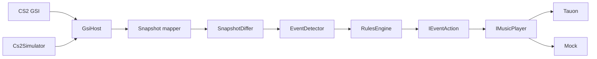

# UndefaultIt

[](https://github.com/AlexGud-HGGames/Undefault/actions/workflows/ci.yml)

**Game-aware music automation** — a local Windows backend in .NET 8. CS2 game state drives pause/resume (and later other commands) on the user's existing music player. Undefault does not own the music catalog. It is local playback control, not a synchronized soundtrack.

The first target player is **Tauon Music Box**. Spotify is dropped ([docs/spotify-constraints.md](docs/spotify-constraints.md)). OAuth is gone (UND-84); remaining mock observe leftovers are deletion-only (UND-101).

> **Code vs docs (2026-09-01):** Current MVP is CS2 + Tauon (`round_start → resume`, `death → pause`). `PIVOT-1`–`PIVOT-8` are in-repo. Live Tauon smoke is [UND-83](https://linear.app/undefault/issue/UND-83/live-tauon-smoke-round-start-resume-death-pause). Spotify leftover deletion is [UND-84](https://linear.app/undefault/issue/UND-84/delete-leftover-spotify-oauthclientaction-paths). Direction: [docs/product-pivot-2026-08-14.md](docs/product-pivot-2026-08-14.md).

## Highlights

- **Layered architecture** — `Core` (domain) / `GsiHost` (ASP.NET Minimal APIs) / `Cs2Simulator`
- **Event pipeline** — snapshot diff → detector → rules engine → actions (config-driven, no YAML scenario engine)
- **Device layer** — `IMusicPlayer` (Tauon default, Mock for `--quick`). Leftover Spotify types are not the live automation path.
- **Local CS2 simulator** with scripted scenarios — develop and test without launching the game
- **xUnit** — three test projects + GitHub Actions CI on `windows-latest`

## Architecture



CS2 (or the simulator) posts JSON to the host. The host normalizes state, detects gameplay events, and runs configured actions against the selected music player. Multi-title routing is in place: CS2 is the full path; Dota 2 currently logs GSI events only.

## Quick start (mock, ~2 min)

```powershell
# Terminal 1 — host with mock player (no real player, no CS2 install)
dotnet run --project .\GsiHost -- --quick

# Terminal 2 — local CS2 GSI simulator
dotnet run --project .\Cs2Simulator
```

Then open `http://127.0.0.1:5292/status`. Watch the host console for `round_start` / `death`.

`--quick` sets `Music:Provider=Mock`. `GET /status` reports GSI plus `IMusicPlayer` fields; leftover Spotify on that payload is not proof of Tauon.

Full runbook: **[docs/](docs/README.md)** · Tauon (target): **[docs/tauon-integration.md](docs/tauon-integration.md)** · architecture: **[docs/backend-architecture.md](docs/backend-architecture.md)**

## Project layout

| Project | Role |
| --- | --- |
| `Core/` | Models, diffing, event detection, rules, playback abstractions |
| `GsiHost/` | HTTP host, GSI mapping, CS2 setup, control profiles, player adapters |
| `Cs2Simulator*` | Console + runtime + scenario packs that post realistic GSI payloads |
| `*.Tests/` | Unit and integration coverage |

## Status & limits

- Windows-first (CS2 cfg install paths and the console launch flow target Windows)
- No desktop UI in this repo — console checklist + local HTTP API
- Tauon remote API (target) has no auth; use loopback; do not expose port 7814
- Safety-first music architecture is documented; runtime integration is still shadow-only
- Dota 2: `POST /gsi/dota` logs events; no adapter or music actions yet

## Docs

| Doc | Contents |
| --- | --- |
| [docs/README.md](docs/README.md) | Documentation index |
| [docs/product-pivot-2026-08-14.md](docs/product-pivot-2026-08-14.md) | Locked product direction |
| [docs/roadmap.md](docs/roadmap.md) | `PIVOT-*` backlog |
| [docs/tauon-integration.md](docs/tauon-integration.md) | Tauon remote API and target setup |
| [docs/music-provider-architecture.md](docs/music-provider-architecture.md) | `IMusicPlayer` target |
| [docs/spotify-constraints.md](docs/spotify-constraints.md) | Why Spotify is not a product backend |
| [docs/quick-launch.md](docs/quick-launch.md) | Startup flags (current binary) |
| [docs/backend-architecture.md](docs/backend-architecture.md) | Pipeline, HTTP, config as implemented today |

Agent/contributor constraints: [AGENTS.md](AGENTS.md).

## License

See [LICENSE](LICENSE).
