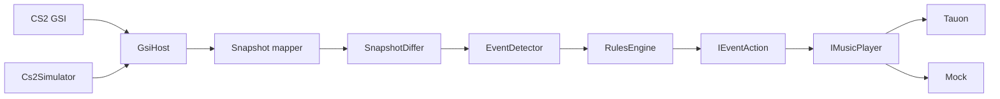

# UndefaultIt

[](https://github.com/AlexksGud/Undefault/actions/workflows/ci.yml)

Undefault is a **local Windows engine** that drives the user's existing music player from game events.

It does not play its own tracks, own a catalog, or build a game soundtrack. CS2 is the first game. The player stays the one already running on the machine.

Default rules today:

```text
round_start → resume
death       → pause
```

That is **Flow**: music during the round, pause on death. A later **Focus** preset (quiet while alive) is planned as a choice, not as the product.

## What it is not

- A CS2 companion (match accept, OBS, overlays, custom MVP files)
- A jukebox or in-game music kit
- A synchronized soundtrack
- A Spotify product. Spotify is dropped; leftover code is deletion-only. See [docs/spotify-constraints.md](docs/spotify-constraints.md).

## Current vs planned

**Shipped on `main`:** CS2 Game State Integration → events → `IMusicPlayer`. Default backend is [Tauon Music Box](docs/tauon-integration.md) over loopback HTTP. `--quick` uses an in-process mock so you can run the pipeline without Tauon or CS2.

**Not shipped:** picking a Windows media session (SMTC), an onboarding UI, extra games as a full automation path. Dota 2 currently logs GSI only.

## Quick start (mock, ~2 min)

```powershell
# Terminal 1 — host with mock player
dotnet run --project .\GsiHost -- --quick

# Terminal 2 — local CS2 GSI simulator
dotnet run --project .\Cs2Simulator
```

Open `http://127.0.0.1:5292/status`. The host console should show `round_start` / `death`.

`--quick` sets `Music:Provider=Mock`. It does not talk to Tauon.

Tauon runbook: [docs/tauon-integration.md](docs/tauon-integration.md). Flags: [docs/quick-launch.md](docs/quick-launch.md).

## How it runs



CS2 or the simulator posts JSON to the host. The host normalizes state, detects events, and applies the active control profile to one `IMusicPlayer` per GSI tick.

## Layout

| Project | Role |
| --- | --- |
| `Core/` | Models, diffing, events, rules, playback contracts |
| `GsiHost/` | HTTP host, GSI mapping, CS2 setup, player adapters |
| `Cs2Simulator*` | Local GSI payloads so you can iterate without the game |
| `tools/SmtcSpike/` | Throwaway Windows media-session harness (evidence only) |
| `*.Tests/` | Unit and integration tests (CI on `windows-latest`) |

## Limits

- Windows-first (CS2 cfg install and console launch)
- No desktop UI — console checklist plus local HTTP
- Tauon remote API has no auth; keep it on loopback; do not expose port 7814
- Safety/mixer specs exist; live mixer side effects are not wired
- Dota 2: `POST /gsi/dota` logs; no music actions yet

## Docs

| Doc | Contents |
| --- | --- |
| [docs/README.md](docs/README.md) | Index |
| [docs/product-pivot-2026-08-14.md](docs/product-pivot-2026-08-14.md) | Locked product direction |
| [docs/roadmap.md](docs/roadmap.md) | Backlog (`PIVOT-*` maps to Linear) |
| [docs/tauon-integration.md](docs/tauon-integration.md) | Tauon HTTP setup |
| [docs/music-provider-architecture.md](docs/music-provider-architecture.md) | `IMusicPlayer` contracts |
| [docs/spotify-constraints.md](docs/spotify-constraints.md) | Why Spotify is not a backend |
| [docs/quick-launch.md](docs/quick-launch.md) | Current binary flags |
| [docs/backend-architecture.md](docs/backend-architecture.md) | Pipeline and HTTP as implemented |

Agent constraints: [AGENTS.md](AGENTS.md). Issues: [Linear](https://linear.app/undefault/project/undefault-2856eb466d02).

## License

See [LICENSE](LICENSE).
