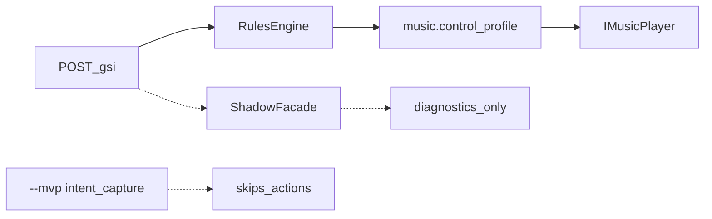

# Предложение: четыре редакционные правки

**Статус:** proposal for review (не approved scope)  
**Ревью:** [editorial-fixes-review-2026-09-04.md](editorial-fixes-review-2026-09-04.md) — читать перед реализацией  
**Дата:** 2026-09-04  
**Контекст:** tech-lead audit leftover / overengineering после product pivot (Tauon + Flow) и SMTC onboarding

## Цель ревью

Проверить, что четыре пункта:

1. действительно мешают продолжению разработки (а не «почистить потому что попросили»);
2. не ломают живой MVP-путь;
3. не выходят за product boundaries (нет Spotify revival, нет live mixer wiring, нет rewrite).

## Живой продукт-путь (не трогать)

```text
POST /gsi → detect → music.control_profile → IMusicPlaybackControl → IMusicPlayer
```

Default Flow: `round_start → resume`, `death → pause`.  
Providers: Tauon (default), SMTC, Mock (`--quick`).

## Вне scope этого предложения

- Dual TFM GsiHost (нужная платформенная цена)
- Полный delete `MusicIntent` / mixer алгебры (later-spec; см. пункт 2)
- Полный delete `TimelineCaptureService` (Dota logging / reset ещё держат)
- Focus-пресет как продукт
- Новые фичи



---

## 1. Удалить мёртвый track-URI profile stack + orphan Spotify/SmartTrackStart config

**Аргумент:** На MVP-пути это не участвует. Flow читает только [`GsiHost/control-profiles.json`](../GsiHost/control-profiles.json) через `IControlProfileService`. Параллельно живёт второй «profile»-мир (`IProfileService` → `profiles.json` → track URI), HTTP `/profiles`, плюс в [`GsiHost/appsettings.json`](../GsiHost/appsettings.json) секции `Spotify` и `SmartTrackStart` без кода-потребителя. Агенты и люди читают [`docs/backend-architecture.md`](backend-architecture.md) и думают, что STS / track profiles — текущий продукт.

**Сделать:**

- Удалить `IProfileService`, [`GsiHost/Services/JsonProfileService.cs`](../GsiHost/Services/JsonProfileService.cs), track-типы в [`Core/Configuration/AppConfig.cs`](../Core/Configuration/AppConfig.cs), DI + `GET/PUT /profiles` в [`GsiHost/Program.cs`](../GsiHost/Program.cs), связанные тесты.
- Убрать `SpotifySystemConfig` / поля Spotify из [`Core/Configuration/SystemConfig.cs`](../Core/Configuration/SystemConfig.cs) и R/W в [`GsiHost/Services/AppSettingsConfigurationService.cs`](../GsiHost/Services/AppSettingsConfigurationService.cs); вырезать секции `Spotify` и `SmartTrackStart` из appsettings (и тестовых JSON-фикстур).
- Оставить `VolumeDuckOptions` (нужны duck/restore); при необходимости переименовать bind-секцию `SpotifyVolumeDuck` → нейтральное имя отдельным мелким шагом в том же PR или следом.
- Подправить устаревшие упоминания в docs, которые утверждают, что STS/`/profiles` ещё живы.

**Не трогать:** `music.control_profile`, `JsonControlProfileService`, Tauon/SMTC/Mock.

**Evidence (audit):** OAuth/`ISpotifyClient` уже удалены (UND-84/101). `/profiles` и track-URI не вызываются onboarding UI и не стоят в ActionMap. `SmartTrackStart` в appsettings — orphan (сервиса нет).

---

## 2. Убрать shadow-orchestration с default hot path

**Аргумент:** Overengineering рядом с MVP. `Core/Music` ≈ 1.7k LOC (~60% Core); на каждом GSI-тике при `ShadowMode: true` (default в appsettings и [`MusicOrchestrationOptions`](../GsiHost/Configuration/MusicOrchestrationOptions.cs)) вызывается facade, который **не** управляет плеером. Параллельно в Core лежат `MusicIntent` / `IMusicMixer` / coalescer **без DI**. Два рассказа об orchestration → риск «дописать facade → player» и получить второго writer (запрещено product boundaries).

**Сделать:**

- Default `ShadowMode = false` (options + appsettings).
- Не регистрировать/не вызывать facade, пока shadow выключен (вызов уже за флагом в [`GsiProcessingService`](../GsiHost/Services/GsiProcessingService.cs); DI сейчас всегда есть).
- Оставить типы + unit-тесты mixer/intent как deferred (или перенести в `Core/Music/Deferred/` без смены поведения) — **не удалять алгебру**, пока нет Linear-решения на Phase B.
- Обновить тесты, которые предполагают shadow on by default.

**Не делать:** wiring mixer → live player.

---

## 3. Убрать коллизию `--mvp` / `intent_capture` с product MVP

**Аргумент:** Плохое архитектурное решение с прод-ценой. [`ConsoleLaunchBootstrap`](../GsiHost/Services/ConsoleLaunchBootstrap.cs) по `--mvp` ставит `intent_capture`, включает Timeline/PlaybackObserver и **отключает** music actions (`DetectAsync` вместо `EvaluateAsync` в [`GsiProcessingService`](../GsiHost/Services/GsiProcessingService.cs)). Имя флага = продуктный термин «MVP», но эффект противоположный (observe-only). Это ~500+ LOC вечного fork + путаница в checklist/smoke.

**Сделать:**

- Удалить флаг `--mvp` (оставить явный `--intent-capture` если tooling ещё нужен owner’у), либо сделать `--mvp` no-op/ошибкой с текстом «use default launch for product MVP».
- Не раздувать timeline: если observe-режим остаётся — только под `--intent-capture`, без product-имени.
- Поправить startup checklist / [`docs/quick-launch.md`](quick-launch.md), где `--mvp` выглядит как способ «запустить MVP».

**Не делать в этом пункте:** полный delete `TimelineCaptureService` (его ещё дергает Dota logging / reset) — отдельный, более рискованный выпил.

---

## 4. Снять ложную совместимость `spotify.control_profile` и пустой `DomainEvents`

**Аргумент:** Оба элемента учат неверную модель. В [`Program.cs`](../GsiHost/Program.cs) второй singleton `MusicControlProfileAction` с `LegacySpotifyKey` регистрируется «на всякий случай», хотя default ActionMap уже `music.control_profile`. `TitleDomainEvent` / `DomainEvents` на `AdapterObservation` всегда `Array.Empty` из [`Cs2GameAdapter`](../GsiHost/Adapters/Cs2GameAdapter.cs) и нигде не потребляются detector’ом — зарезервированная труба без consumer. Это не фичи, а шум границ multi-title / Spotify-эпохи.

**Сделать:**

- Убрать вторую DI-регистрацию и `LegacySpotifyKey` (и тесты alias); неизвестный action key в ActionMap остаётся no-op/log без регистрации Spotify-имени.
- Удалить `DomainEvents` / `TitleDomainEvent` из observation contract и adapter, пока не появится реальный consumer (UND-45+).
- Не трогать `GameAdapterRouter` diagnostics и Dota log-only endpoint.

---

## Порядок выполнения

`1 → 4 → 2 → 3`  
(сначала мёртвое API/config, потом alias/DomainEvents, потом shadow default, потом flag rename — меньше конфликтных диффов).

## Acceptance

- `dotnet test` зелёный
- default launch без флагов по-прежнему делает Flow pause/resume через Mock/Tauon
- ни один из четырёх пунктов не добавляет новых фич
- docs, которые утверждали STS/`/profiles`/`--mvp` как текущий продукт, приведены в соответствие

## Вопросы ревьюеру

1. Пункт 3: предпочесть hard-error на `--mvp` или silent remove + только `--intent-capture`?
2. Пункт 2: достаточно `ShadowMode=false`, или сразу перенос mixer-типов в `Deferred/`?
3. Пункт 1: переименовать `SpotifyVolumeDuck` в том же изменении или отдельным follow-up?
4. Нужен ли Linear issue на каждый пункт, или один umbrella issue?
